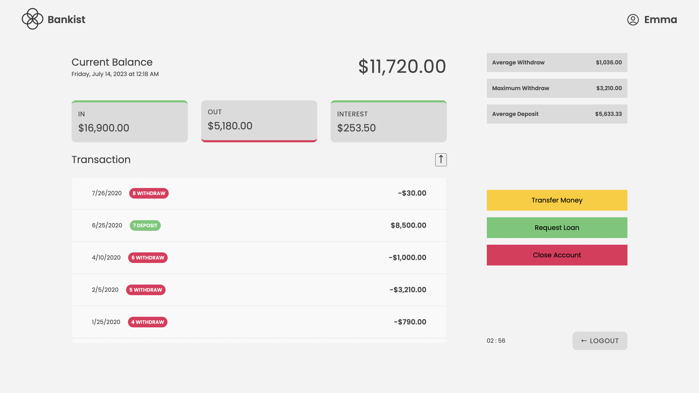

# Bankist-Operations

# Bankist
Bankist is an imaginary and simple online banking application that provides a seamless digital banking experience. It offers
 
- Login/Logout
- Transfer
- Deposit
- Close Account
- Session Management

## What is Bankist ?
[Bankist](https://bankist-operations.vercel.app/) is an imaginative and user-friendly online banking platform. While incorporating all the essential features of a real-world bank, Bankist also introduces some notable enhancements in terms of UI design and extended session management. This project was part of an online course. additionally, the session management functionality has been extended to ensure enhanced security and uninterrupted access for users.

## Accessing Accounts
Here are the login credentials for accessing the bank functionality. All the data is stored and retrieved from local storage. Remember that the username should always be in lowercase when logging in.

### Account One
- Username: bt
- Password: 111

### Account Two
- Username: ej
- Password: 2222

## Technologies Used
- HTML
- CSS
- JavaScript

